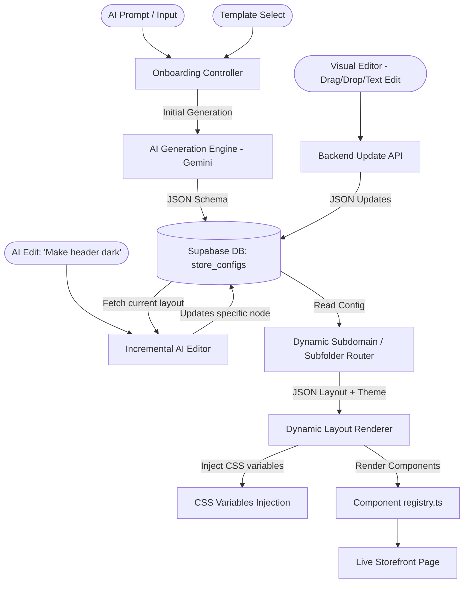
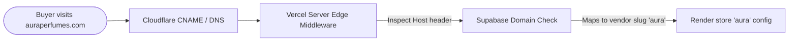

# Full Project Roadmap: Schema-Driven E-Commerce & AI Site Builder

This document outlines the detailed roadmap, architecture, and step-by-step implementation plan for both **Phase 1 (MVP Foundation)** and **Phase 2 (Visual Editor, Iterative AI, and Live Deployment)** of your dynamic e-commerce platform.

---

# Architecture Diagram

This combined architecture supports:
1. Initial layout selection (Manual Template or AI Prompt).
2. Live interactive layout editing (Visual Dashboard).
3. AI-powered incremental edits (Iterative prompts like *"Make the header dark"*).



---

# PHASE 1: MVP FOUNDATION

Phase 1 focuses on creating the core layout rendering engine, building the first 12 global components, and implementing the initial generation flow (manual template selection or direct AI generation).

## 1. Database Schema (Supabase)

A dynamic store is represented entirely as configuration data in a single row in the database.

### Table: `stores`
| Column Name | Type | Description |
| :--- | :--- | :--- |
| `id` | `uuid` (PK) | Unique identifier. |
| `vendor_id` | `uuid` (FK) | Owner of the store. |
| `name` | `text` | Display name of the store. |
| `slug` | `text` (Unique) | URL handle (e.g., `lux-watches` maps to `lux-watches.yourdomain.com`). |
| `niche` | `text` | Business niche (e.g., `apparel`, `cosmetics`). |
| `description` | `text` | Slogan or brand tagline. |
| `layout_config` | `jsonb` | The JSON layout config containing theme styling parameters and sections. |
| `is_published` | `boolean` | Flag indicating if the storefront is publicly live. |
| `created_at` | `timestamp` | Row creation timestamp. |

### Schema: `layout_config` JSON Structure
```json
{
  "theme": {
    "colors": {
      "primary": "#0f172a",
      "secondary": "#d97706",
      "background": "#ffffff",
      "text": "#1e293b"
    },
    "typography": {
      "heading": "Playfair Display",
      "body": "Inter"
    }
  },
  "sections": [
    {
      "id": "hero-split-001",
      "type": "HeroSplitImage",
      "props": {
        "title": "Artisan Coffee Roasters",
        "subtitle": "Freshly roasted single-origin coffee beans delivered to your door.",
        "ctaText": "Shop Now",
        "ctaLink": "/products",
        "imageAlignment": "right",
        "imageUrl": "https://images.unsplash.com/photo-1514432324607-a09d9b4aefdd"
      }
    },
    {
      "id": "features-grid-001",
      "type": "FeatureGrid",
      "props": {
        "columns": 3,
        "items": [
          { "icon": "truck", "title": "Fresh Roast", "description": "Roasted daily in small batches" },
          { "icon": "leaf", "title": "Ethically Sourced", "description": "Direct trade with farmers" },
          { "icon": "coffee", "title": "Perfect Grind", "description": "Custom ground for your machine" }
        ]
      }
    },
    {
      "id": "featured-products-001",
      "type": "ProductGridFeatured",
      "props": {
        "title": "Our Best Blends",
        "limit": 4
      }
    }
  ]
}
```

---

## 2. Component Registry (`registry.ts`)
Create a single map where every component type is imported and registered. This ensures safety and prevents runtime execution of arbitrary scripts.

```typescript
// @/components/registry.ts
import HeaderStandard from "./sections/HeaderStandard";
import FooterDetailed from "./sections/FooterDetailed";
import HeroSplitImage from "./sections/HeroSplitImage";
import HeroCenteredOverlay from "./sections/HeroCenteredOverlay";
import PromoBanner from "./sections/PromoBanner";
import FeatureGrid from "./sections/FeatureGrid";
import ProductGridFeatured from "./sections/ProductGridFeatured";
import ProductSingleFocus from "./sections/ProductSingleFocus";
import CategoryCarousel from "./sections/CategoryCarousel";
import TestimonialSlider from "./sections/TestimonialSlider";
import BrandStory from "./sections/BrandStory";
import NewsletterSignup from "./sections/NewsletterSignup";

export const REGISTRY = {
  HeaderStandard,
  FooterDetailed,
  HeroSplitImage,
  HeroCenteredOverlay,
  PromoBanner,
  FeatureGrid,
  ProductGridFeatured,
  ProductSingleFocus,
  CategoryCarousel,
  TestimonialSlider,
  BrandStory,
  NewsletterSignup,
};

export type SectionType = keyof typeof REGISTRY;
```

---

## 3. Component Visual Design & Layout Specifications

To achieve a "premium, state-of-the-art" visual design across all niches, every component is engineered to follow design rules driven by theme variables. Below are the design definitions and styling variations for the 12 core components.

### A. Navigation & Header Components

#### 1. `HeaderStandard`
*   **Design & Visuals:** 
    *   **Glassmorphic Floating Navbar:** Built using Tailwind's frosted-glass utilities (`backdrop-blur-md bg-white/70` in light theme, or `bg-slate-950/70` in dark theme). 
    *   Includes a thin, glowing border bottom (`border-b border-slate-200/50`).
    *   Smooth transitions (`transition-all duration-300`) that shrink the header size on page scroll.
    *   Links have micro-animations: hover triggers a smooth center-out underline slide (`bg-secondary h-[2px] transition-all`).
*   **Layout Variations:**
    *   `classic`: Logo on the left, navigation items centered, shopping cart and account icons on the right.
    *   `centered`: Logo centered at the top, menu links wrapped in a row below the logo (best for clean luxury brands).

#### 2. `FooterDetailed`
*   **Design & Visuals:** 
    *   Uses high-contrast backgrounds (defaults to the secondary brand color or a deep neutral slate `bg-slate-900` to anchor the page).
    *   Structured, clean text columns with clear typography hierarchy (`tracking-wider uppercase font-semibold text-xs text-slate-400`).
*   **Layout Variations:**
    *   `multi-column`: 4-column layout including collections list, customer care, brand story summary, and newsletter form.
    *   `minimalist`: Centered grid with social media icons and copyright information, maximizing empty white space.

---

### B. Hero & Promotional Components

#### 3. `HeroSplitImage`
*   **Design & Visuals:** 
    *   **Asymmetric 50/50 Split Grid:** High-end layout dividing text copy and imagery.
    *   Images use high-quality rendering borders (`rounded-3xl` or creative mask frames) and subtle lift-shadows (`shadow-2xl`).
    *   Primary CTA buttons use a glowing hover effect (`hover:shadow-[0_0_20px_var(--color-primary)]` with quick scale transformation `hover:scale-105 transition-all`).
    *   Text animations slide up and fade in dynamically.
*   **Layout Variations:**
    *   `image-right` / `image-left`: Alternates media side (useful for grid consistency).
    *   `asymmetric-offset`: Image is slightly smaller, offset with a background colored square card matching the secondary brand color.

#### 4. `HeroCenteredOverlay`
*   **Design & Visuals:** 
    *   **Cinematic Background Video/Image:** Large immersive header covering 75% to 100% of viewport height.
    *   Uses high-contrast color overlays (`bg-gradient-to-t from-black/80 via-black/30 to-transparent`) to ensure text legibility.
    *   Text uses elegant serif heading families (`font-heading`) with larger sizing (`text-4xl md:text-6xl tracking-tight`).
    *   CTA is either a solid primary color block or an elegant ghost button with thin borders.
*   **Layout Variations:**
    *   `full-screen`: Covers the entire user browser height with a downward scroll indicator.
    *   `boxed-banner`: Center-aligned container with rounded borders, leaving margins on the side for a modern framed look.

#### 5. `PromoBanner`
*   **Design & Visuals:** 
    *   Highly colorful ribbon used for announcements or discount vouchers.
    *   Features optional automatic horizontal scrolling ticker text (marquee effect) for promotions (e.g., *"Free shipping on orders over $50 • Use coupon FIRST10 • Free shipping..."*).
*   **Layout Variations:**
    *   `ribbon`: Top thin fixed strip above the header (height ~40px).
    *   `card`: Middle page promotional container featuring a mockup coupon card that users can copy to clipboard with a hover action.

#### 6. `FeatureGrid` (USPs)
*   **Design & Visuals:** 
    *   Clean minimal card boxes representing store benefits (e.g. Free shipping, organic).
    *   Icons are line-drawn outline icons (`lucide-react`) colored in the primary theme color.
    *   Hovering over cards lifts them slightly (`hover:-translate-y-1.5 shadow-sm hover:shadow-md transition-all duration-300`).
*   **Layout Variations:**
    *   `3-column-bordered`: Columns separated by thin light dividers.
    *   `4-column-cards`: Standalone floating cards with light shadows and background colors.

---

### C. E-Commerce Display Components

#### 7. `ProductGridFeatured`
*   **Design & Visuals:** 
    *   Standard grid display of product items.
    *   **Aspect Ratio Uniformity:** All product image containers locked to `aspect-[4/5]` (editorial vertical look) or `aspect-square`.
    *   **Hover-Zoom Effect:** Product image scales up slightly inside a hidden overflow wrapper (`group-hover:scale-105 transition-transform duration-700`).
    *   **Interactive Overlays:** A "Quick Shop" button slides up from the bottom of the card on hover.
    *   Badges for "New" or "Sale" are positioned on corners using secondary colors.
*   **Layout Variations:**
    *   `grid-4`: 4-column responsive grid (collapsing to 2 columns on mobile).
    *   `grid-3-large`: 3-column grid showing larger imagery with text descriptions aligned left.

#### 8. `ProductSingleFocus`
*   **Design & Visuals:** 
    *   Showcase of a single star item. Editorial styling inspired by print magazines.
    *   Features a large-scale product zoom image beside a detailed specifications list, pricing, options (e.g., size or material buttons), and a checkout trigger.
    *   Surrounded by generous white space to draw full focus to the flagship product.
*   **Layout Variations:**
    *   `details-right`: Standard details side.
    *   `details-bottom`: Asymmetrical gallery displaying images on top and description details structured underneath in wide sections.

#### 9. `CategoryCarousel`
*   **Design & Visuals:** 
    *   Perfect for stores with multiple item collections (e.g. "Watches", "Straps", "Cases").
    *   Circular thumbnails or small rounded cards with text labels.
    *   Supports drag-scrolling and horizontal swipe gestures on touch devices.
*   **Layout Variations:**
    *   `circles`: Circular items with border rings highlighting them on hover.
    *   `cards-overlay`: Square cards with a semi-opaque dark gradient overlay and category names centered in white bold text.

---

### D. Social Proof & Story Components

#### 10. `BrandStory`
*   **Design & Visuals:** 
    *   Humanizes the store. Features editorial columns with brand statements.
    *   Offset overlay blocks: The image grid and colored card panels overlap creatively (`-translate-x-4 -translate-y-4` overlays).
    *   Focuses on premium typography blocks.
*   **Layout Variations:**
    *   `image-right`: Visual column on the right side.
    *   `centered-editorial`: High contrast text column centering on quotes, with small secondary images floating around it.

#### 11. `TestimonialSlider`
*   **Design & Visuals:** 
    *   Social validation cards.
    *   Includes large, low-opacity stylized quote icons (`text-primary/10`).
    *   Includes user ratings (star icon icons colored in gold/orange) and circular customer avatar images.
    *   Cards transition smoothly with a slide or fade opacity effect.
*   **Layout Variations:**
    *   `carousel`: Rotates one large quote review at a time.
    *   `masonry-grid`: 3 static testimonial boxes side-by-side with varying heights.

#### 12. `NewsletterSignup`
*   **Design & Visuals:** 
    *   Focus banner to convert visitors to subscribers.
    *   Glassmorphic text inputs with floating labels that animate upwards on focus.
    *   Sign-up buttons change opacity and show loading states during verification.
*   **Layout Variations:**
    *   `full-width-strip`: A thin, full-width section with inline inputs, taking up minimal space.
    *   `centered-box`: Large featured box inside a container, styled with an organic gradient background matching the primary and secondary theme colors.

---

---

## 3. Dynamic Page Renderer
To display the store dynamically, we load the JSON configuration and map it directly to React components.

```tsx
// app/store/[slug]/page.tsx
import { notFound } from "next/navigation";
import { REGISTRY } from "@/components/registry";
import { supabase } from "@/lib/supabaseServer"; // Supabase service client

interface SectionConfig {
  id: string;
  type: keyof typeof REGISTRY;
  props: any;
}

export default async function StorefrontPage({ params }: { params: { slug: string } }) {
  // 1. Fetch config from Supabase
  const { data: store, error } = await supabase
    .from("stores")
    .select("layout_config, name")
    .eq("slug", params.slug)
    .single();

  if (error || !store) {
    return notFound();
  }

  const { theme, sections } = store.layout_config as { theme: any; sections: SectionConfig[] };

  // 2. Inject CSS Theme Variables and render the sequence
  return (
    <div 
      className="min-h-screen text-var-text bg-var-bg"
      style={{
        "--color-primary": theme.colors.primary,
        "--color-secondary": theme.colors.secondary,
        "--color-bg": theme.colors.background,
        "--color-text": theme.colors.text,
        "--font-heading": theme.typography.heading,
        "--font-body": theme.typography.body,
      } as React.CSSProperties}
    >
      <REGISTRY.HeaderStandard logoUrl="" navigation={[]} alignment="left" />
      
      <main>
        {sections.map((section) => {
          const Component = REGISTRY[section.type];
          if (!Component) return null;
          
          return <Component key={section.id} {...section.props} />;
        })}
      </main>

      <REGISTRY.FooterDetailed copyrightText={`© ${store.name}`} socialLinks={[]} sections={[]} />
    </div>
  );
}
```

---

## 4. Phase 1 Implementation Steps

*   **Step 1: Set up styling & CSS variables.** Configure Tailwind to read your injected custom variables for colors and font sizes.
*   **Step 2: Build the 12 core components.** Code the responsive, dynamic sections in `/components/sections/` and export them in `registry.ts`.
*   **Step 3: Create the Routing & Renderer.** Implement the `app/store/[slug]/page.tsx` rendering loop.
*   **Step 4: Design static onboarding templates.** Create a `templates.json` mapping out 3 default designs: *Watch Shop*, *Cosmetics*, and *Organic Food*.
*   **Step 5: Develop the Gemini API Initial Generation endpoint.** Create `/api/generate-store`. Give the LLM clear instructions on the JSON layout format, your component library props, and have it output a generated store matching the user's prompt.

---

## 5. Team Assignment & Component Division

To balance development workload and ensure clean separation of concerns, the 15 components are divided among the 4 team members. As requested, **Iqra and Amna are assigned only Low to Medium complexity tasks**, while **Malaika and Hafsa handle the High complexity system operations**:

### Member 1: Iqra (Focus: Low-Medium Layout Elements)
*   **`HeaderStandard`**  — Frost-glass floating navigation layout, shrink-on-scroll animations, and link underlines.
*   **`FooterDetailed`**  — Dynamic multi-column layout for site directory links and secondary text.
*   **`PromoBanner`**  — Scrolling marquee notification bar and coupon layout.
*   **`FeatureGrid`**  — Card block layout for store benefits with outline icons.

### Member 2: Amna (Focus: Low-Medium Content & Social Proof)
*   **`TestimonialSlider`**  — Customer rating stars, user avatars, and quote deck swipers.
*   **`NewsletterSignup`**  — Input fields with focus glowing effects and form validation.
*   **`BrandStory`**  — Magazine editorial blocks with asymmetric overlapping shapes.


### Member 3: Malaika (Focus: Layout Engine & Interactive Shells)
*   **`StorefrontRenderer`** — Responsible for Next.js routing, fetching the JSON config from Supabase, mapping sections, and injecting CSS variables.
*   **`CartDrawer`**  — Dynamic persistent shopping cart state context, add/remove functions, sliding drawer transition animations, and checkout triggers.
*   **`HeroSplitImage`**  — Responsive left/right split visuals, offset card designs, and dynamic CTA buttons.
*   **`HeroCenteredOverlay`**  — Cinematic background overlays, typography size rules, and parallax scrolls.

### Member 4: Hafsa (Focus: E-Commerce Product Listing & Showcase)
*   **`ProductGridFeatured`**  — Database integration to fetch real items and layout-rendering grids.
*   **`ProductCard`**  — Image hover scale animation, dynamic discount badges, and "Quick Add" slider overlay.
*   **`ProductSingleFocus`**  — Feature showcase with checkout selectors (size, color options).
*   **`CategoryCarousel`**  — Touch-scrollable circle list items for store categories.

---
---

# PHASE 2: ADVANCED EDITOR & PRODUCTION PUBLISHING

Phase 2 turns the passive generator into an active, interactive website builder. It introduces visual editing, interactive AI adjustments, dynamic e-commerce actions, and domain publishing.

## 1. Visual Layout Editor Dashboard
Give vendors a backend dashboard (`/dashboard/editor/[slug]`) to edit their storefront visually.

```
+-----------------------------------------------------------+
| [Back]   Store: Aura Perfumes     [AI Edit] [Save] [Publish]|
+-------------------+---------------------------------------+
| SECTIONS          | PREVIEW (Mobile / Desktop toggle)     |
|                   | +-----------------------------------+ |
| - Header          | |           Aura Perfumes           | |
| - HeroSplit [Edit]| | [Hero Image]  Discover scents that| |
| - FeatureGrid     | |               tell your story.    | |
| - ProductGrid     | |               [Shop Now]          | |
|                   | +-----------------------------------+ |
| [Add Section]     | | Free Shipping  | Organic Formula  | |
|                   | +-----------------------------------+ |
| THEME             | | [Product Card] | [Product Card]   | |
| - Fonts           | | $85.00         | $95.00           | |
| - Color Palette   | +-----------------------------------+ |
+-------------------+---------------------------------------+
```

### Visual Editor Engine Features:
*   **Component List Sidebar:** Shows the current ordering of components. Drag-and-drop to reorder sections.
*   **Prop Config Form Panel:** Clicking a section opens a configuration form (e.g., editing the Hero title text, button link, or uploading a new banner image).
*   **Live Preview Frame:** An `iframe` displaying `/store/[slug]?preview=true` that listens for changes via `postMessage`. When the user edits props in the panel, the iframe updates instantly without reloading.

---

## 2. Iterative AI Editing (Refinement Prompts)
Instead of forcing users to build manually, let them use an AI side-assistant to modify parts of the site.

### The Problem:
If a user generated a watch store, and then asks: *"Make the background dark and add a newsletter signup under the hero"*, we cannot regenerate the entire site from scratch because the user might have custom-written details they want to keep.

### The Solution (Incremental AI Patching):
Use a prompt setup where the AI acts as a **JSON patch selector**. You send:
1. The user's editing prompt.
2. The current `layout_config` JSON.
3. Instructions to modify only specific parameters or inject/remove specific objects from the `sections` array.

#### Example API Endpoint `/api/refine-store`:
```typescript
export async function POST(req: Request) {
  const { currentLayout, userEditInstruction } = await req.json();

  const prompt = `
    You are an expert design assistant. Below is the user's current website layout configuration.
    Current Layout JSON:
    ${JSON.stringify(currentLayout)}

    The user wants to make this modification: "${userEditInstruction}"
    
    You must modify the Current Layout JSON to fulfill this request.
    Rules:
    1. If the user asks to change theme colors or fonts, modify the "theme" block.
    2. If the user asks to add a section, generate a new component block from the available registry list and insert it at the correct index.
    3. Keep existing text, products, and links intact unless explicitly told to modify them.
    4. Respond ONLY with the fully updated JSON object. Do not include markdown wraps.
  `;

  const updatedLayoutJson = await callGemini(prompt);
  return NextResponse.json({ updatedLayout: JSON.parse(updatedLayoutJson) });
}
```

---

## 3. Dynamic E-Commerce Integrations
Static components need to function as a live shop.

*   **Dynamic Product Rendering:** The `ProductGridFeatured` component queries your database's `products` table, filtered by `vendor_id`. The user configures categories, prices, and stock in their inventory dashboard, and it updates live on the storefront.
*   **Persistent Shopping Cart Drawer:** A global React Context manages the shopper's cart state. Clicking "Add to Cart" on any dynamic section opens a slide-over cart drawer.
*   **Checkout & Escrow:** Integration with your Stripe/escrow payment system. When the checkout button is clicked, redirect the buyer to a Stripe Checkout Session associated with the vendor's payment account.

---

## 4. Multi-Tenant Custom Domains
Allow vendors to map their own domains (e.g., `www.auraperfumes.com`) instead of just using subdomains (`aura.yourdomain.com`).



### Routing Setup with Vercel Middleware:
Implement a Next.js middleware file to rewrite incoming domain headers internally:

```typescript
// middleware.ts
import { NextResponse } from "next/server";
import type { NextRequest } from "next/server";

export function middleware(req: NextRequest) {
  const url = req.nextUrl;
  const hostname = req.headers.get("host") || "";

  // 1. Exclude system asset files and API routes
  if (
    url.pathname.startsWith("/_next") ||
    url.pathname.startsWith("/api") ||
    url.pathname.startsWith("/static")
  ) {
    return NextResponse.next();
  }

  // 2. Identify dynamic hostnames
  // Main app: yourdomain.com
  // Vendor domain: aura.yourdomain.com OR auraperfumes.com
  const isMainApp = hostname === "yourdomain.com" || hostname === "localhost:3000";

  if (isMainApp) {
    return NextResponse.next();
  }

  // 3. Rewrite mapping:
  // auraperfumes.com/products -> /store/auraperfumes-slug/products
  const slug = hostname.replace(".yourdomain.com", ""); // handles subdomain
  
  // Rewrite internally to the dynamic store route folder
  return NextResponse.rewrite(new URL(`/store/${slug}${url.pathname}`, req.url));
}
```

---

## 5. Phase 2 Implementation Steps

*   **Step 1: Build the Visual Editor interface.** Create the sidebar listing sections and layout settings, accompanied by the live-updating preview iframe.
*   **Step 2: Connect Database updates.** Save dashboard edits directly back to Supabase `stores.layout_config`.
*   **Step 3: Setup the Incremental AI Refinement API.** Integrate the Gemini model to parse user layout commands (e.g., "add newsletter section", "change buttons to purple") and update the existing store JSON.
*   **Step 4: Integrate active cart & checkout.** Connect the components to a shared context cart state and configure Checkout APIs.
*   **Step 5: Setup dynamic domain rewrites.** Deploy the Next.js middleware routing configuration and build a custom domain management field in the admin dashboard (e.g., integrations using Vercel Domains API or Cloudflare API).
*   **Step 6: Optimizations.** Apply CDN caching (Incremental Static Regeneration - ISR) to store layout pages so buyer sites load instantly (sub-100ms) and only hit the database when the vendor republishes their layout.
